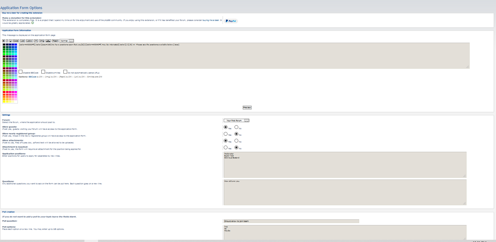
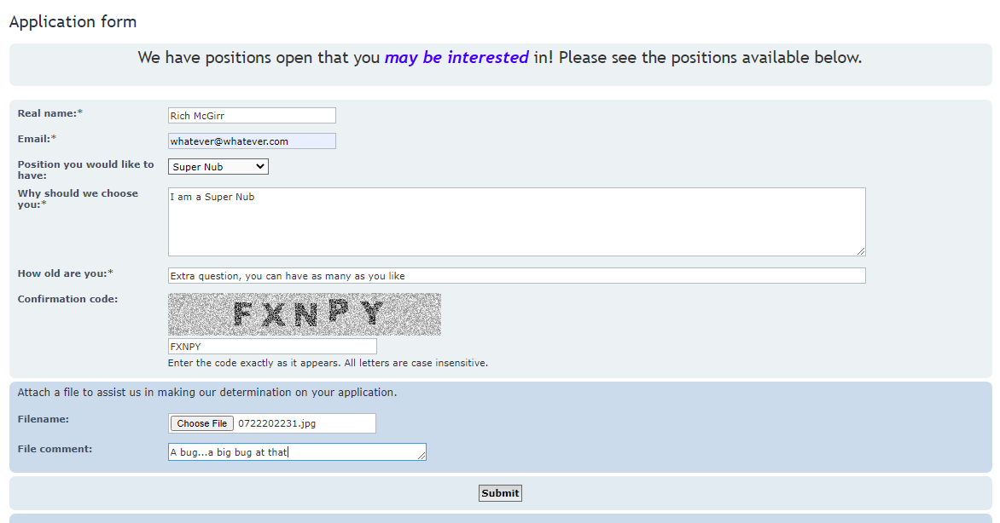
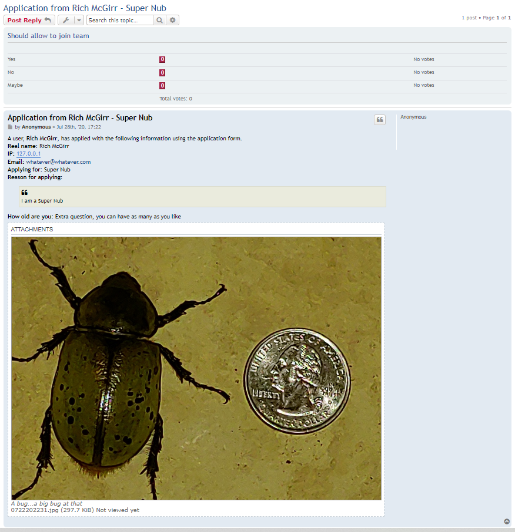

applicationform
=========================

phpBB extension that allows users to apply for certain team positions. The applications are sent to a forum, as chosen in the ACP settings of the extension, where administrators can read them and see if the users are the best for the position.

[](https://travis-ci.org/rmcgirr83/applicationform)

ACP Settings


The Application Form


Registered User Application Submittal


Guest Post on the Forum from the application


## Installation

### 1. clone
Clone (or download and move) the repository into the folder ext/rmcgirr83/applicationform:

```
cd phpBB3
git clone https://github.com/rmcgirr83/applicationform.git ext/rmcgirr83/applicationform/
```

### 2. activate
Go to admin panel -> tab customise -> Manage extensions -> enable Application Form

Within the Admin panel visit the Extensions tab and choose the settings for the extension.

## Update instructions:
1. Go to you phpBB-Board > Admin Control Panel > Customise > Manage extensions > Application Form: disable
2. Delete all files of the extension from ext/rmcgirr83/applicationform
3. Upload all the new files to the same locations
4. Go to you phpBB-Board > Admin Control Panel > Customise > Manage extensions > Application Form: enable
